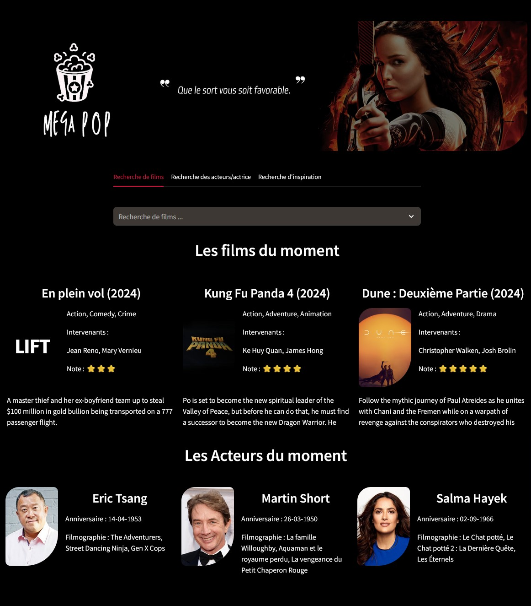
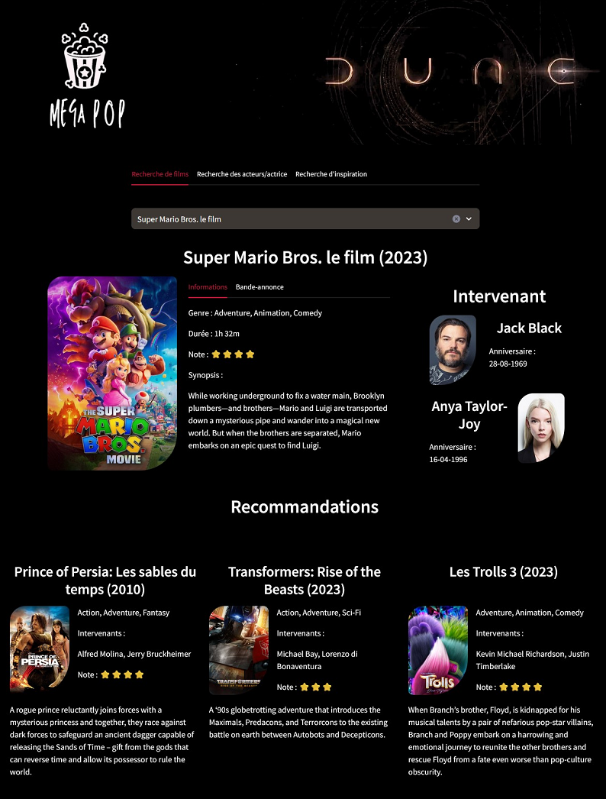

## ASMT Projet 2 : Création d’une application de recommandation de films via IMDB et TMDB sur streamlit. 

Cinéma MEGA Pop 

####  description: 

Bienvenue dans notre Application de Recommandation de Films, conçue pour vous aider à découvrir de nouveaux films passionnants en fonction de vos préférences. Cette documentation vous guidera à travers l'utilisation de l'application, de la recherche de films à la consultation des recommandations.

Documentation d'utilisation - Application de Recommandation de Films

### Page d'Accueil
<strong>1. Recherche de Films</strong>.

Utilisez la barre de recherche pour trouver des films spécifiques en saisissant le titre dans la zone de recherche. Appuyez sur Entrée pour afficher les résultats de la recherche. Les résultats seront affichés sous forme de liste de films correspondant à votre recherche.

<strong>2. Consultation des Recommandations</strong>.

Une fois sur la page d'accueil, parcourez les Films du Moment pour découvrir des films recommandés. Cliquez sur le nom d'un film pour afficher plus de détails, y compris le synopsis complet, les avis des utilisateurs et d'autres informations pertinentes.

<strong>3. Navigation Facile</strong>.

Notre application est conçue pour une expérience utilisateur fluide et intuitive. Utilisez simplement la barre de recherche pour rechercher des films spécifiques ou explorez les recommandations présentées sur la page d'accueil.

<strong>4. Conclusion</strong>.

Profitez pleinement de notre Application de Recommandation de Films pour découvrir des œuvres cinématographiques captivantes et passionnantes. Que vous recherchiez un film en particulier ou que vous souhaitiez explorer de nouvelles recommandations, notre application est là pour vous guider dans votre voyage cinématographique.
Merci d'utiliser notre application et n'hésitez pas à nous contacter si vous avez des questions ou des commentaires. Bonne exploration cinématographique !

En ouvrant l'application, vous serez accueilli par notre page d'accueil conviviale.

Voici ce que vous y trouverez :

<b>Barre de Recherche :</b>  En haut de la page, vous trouverez une barre de recherche où vous pouvez saisir le titre d'un film que vous souhaitez rechercher. Appuyez sur Entrée pour afficher les résultats de la recherche.

<b>Logo :</b>  Situé à gauche de la barre de recherche, notre logo vous rappellera l'identité de notre application.

<b>Films du Moment : </b> Juste en dessous de la barre de recherche, vous verrez trois blocs présentant les films du moment. Chaque bloc contient le nom du film, son affiche, l'année de sortie, la note sous forme d'étoiles et un synopsis concis pour vous donner un aperçu du film.

### Accès à la Page Film

Pour accéder à la page Film, suivez ces étapes simples :

Lancez l'application de recommandation de films.

Depuis la page d'accueil, lancer votre recherche grâce à la barre de recherche en haut, puis cliquez sur le film que vous souhaitez explorer davantage.
Vous serez redirigé vers la page Film où vous pourrez trouver toutes les informations pertinentes sur le film sélectionné.

### Interface de la Page Film:

La page Film est conçue pour offrir une expérience utilisateur intuitive et informative. 

Voici une vue d'ensemble de son interface :

<b> Section Principale - Détails du Film</b>
  

<b>Affiche du Film:</b> En haut de la page, vous trouverez l'affiche du film sélectionné, permettant une identification visuelle rapide.

<b>Nom du film: </b> Juste en dessous de l'affiche, le nom du film est affiché en mettant en valeur son titre.

<b>Année de Sortie:</b>  À côté du nom du film, l'année de sortie du film est indiquée, fournissant une indication de son époque.

<b>Liste des intervenants </b> 

<b>note </b> sous format étoiles ⭐

<b>Synopsis: </b> Sous l'année de sortie, vous trouverez un synopsis concis du film, résumant son intrigue principale et ses thèmes.

<b>Bande annonce :</b>  pour visualiser un aperçu du film et améliorer l'expérience utilisateur

  
### Section Acteurs et Actrices:
  

<b>Liste des Acteurs et Actrices: </b> Après le synopsis, une liste des acteurs et actrices principaux du film est fournie, permettant aux utilisateurs de découvrir les talents impliqués dans la production du film.

<b>Section Suggestions de Films:</b>

<b>Films Similaires:</b> En bas de la page, vous trouverez trois box présentant des suggestions de films similaires au film principal que vous explorez.
  
Chaque suggestion de film est accompagnée de son <b>affiche</b> ,de son <b>nom</b> ,de son <b>année de sortie</b> ,de sa <b> note</b> sous forme d'étoiles ⭐, et d'un <b>synopsis</b> concis.
Ces suggestions sont soigneusement sélectionnées en fonction de critères tels que le genre, l'année de sortie, le nombre de votes, la popularité, afin de garantir une expérience de recommandation personnalisée.

### Catégorie "Explorez des Films Captivants et Inoubliables"

Les suggestions de films présentées dans cette section visent à diversifier la sélection de films et à offrir à l'utilisateur une gamme étendue de choix pour son prochain visionnage.

Utilisation Recommandée:

Utilisez la section principale pour obtenir des informations détaillées sur un film spécifique.
Explorez la liste des acteurs et actrices pour en apprendre davantage sur les talents impliqués dans la production du film.
Parcourez les suggestions de films similaires pour découvrir de nouveaux titres correspondant à vos goûts cinématographiques.

### Accès à la Page Acteur

Pour accéder à la page Acteur, suivez ces étapes simples :
Lancez l'application de recommandation de films.
Depuis la page d'accueil, utilisez la barre de recherche pour trouver l'acteur ou l'actrice que vous souhaitez explorer.
Cliquez sur le résultat correspondant à votre recherche pour accéder à la page Acteur.
Interface de la Page Acteur:
La page Acteur offre une interface conviviale et informative pour découvrir des informations détaillées sur vos acteurs et actrices préférés. Voici une vue d'ensemble de son interface :
Barre de Recherche:
Utilisez la barre de recherche en haut de la page pour trouver rapidement l'acteur ou l'actrice que vous souhaitez explorer.
Section "Résultat de Votre Recherche":
Encadré de l'Acteur Principal: Dans cette section, vous trouverez les détails principaux de l'acteur ou de l'actrice que vous avez recherché.
Photo de l'acteur: Une photo représentative de l'acteur ou de l'actrice est affichée pour une identification visuelle rapide.
Nom et Prénom: Le nom complet de l'acteur ou de l'actrice est affiché pour une identification précise.
À Propos: Sous le nom, vous trouverez des informations sur la date et le lieu de naissance de l'acteur ou de l'actrice, ainsi que des détails sur ses prochains films et une brève biographie.
Section "Filmographie":
Suggestions de Films: En dessous de l'encadré de l'acteur principal, vous trouverez une sélection de films issus de la filmographie de l'acteur ou de l'actrice.
Chaque suggestion de film est présentée dans une box distincte, contenant une affiche du film, son nom, son année de sortie, sa note sous forme d'étoiles ⭐, et un synopsis concis.
Les suggestions de films sont limitées aux quatre titres les plus récents de la filmographie de l'acteur ou de l'actrice, offrant ainsi un aperçu de ses projets les plus récents.
Utilisation Recommandée:
Utilisez la section "Résultat de Votre Recherche" pour obtenir des informations détaillées sur un acteur ou une actrice spécifique.
Explorez la filmographie de l'acteur ou de l'actrice pour découvrir ses projets les plus récents et obtenir des suggestions de films basées sur son travail.
Utilisez la barre de recherche pour trouver d'autres acteurs ou actrices que vous souhaitez explorer.
